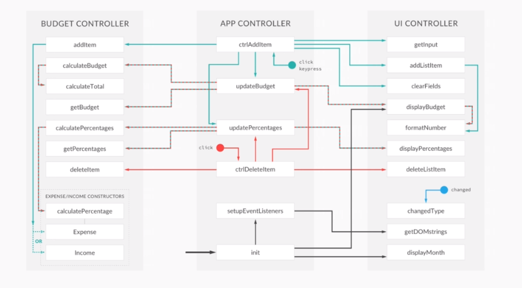

#  Javascript budgeting app
This is an example of a simple web application to calculate a budget and provide expense percentages written in ES5.

## Final Architecture of the Aplication 

This program was build while following the *The Complete JavaScript Course*